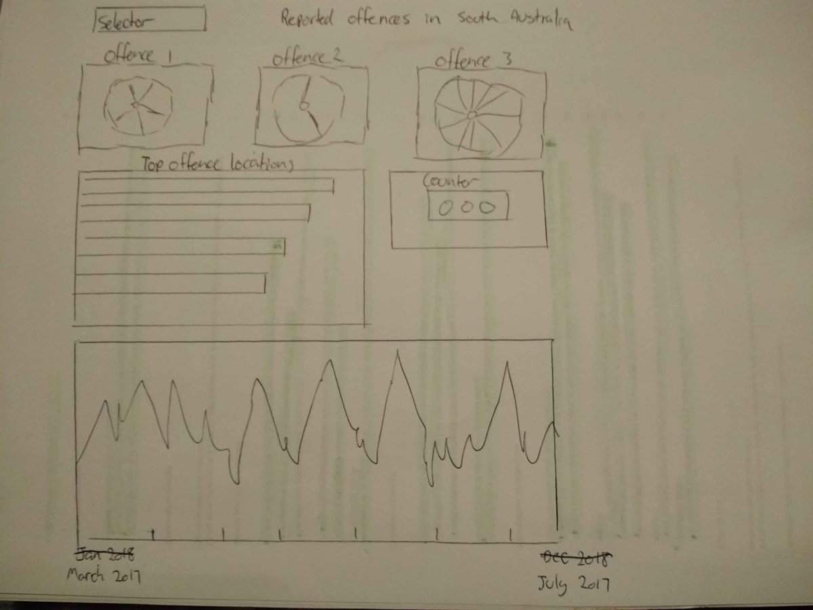

# Reported offences in South Australia
This is my second milestone project for the Full-Stack software development course through Code Institute.
When it came to the decision as to which project option to choose, I liked the idea of making an interactive dashboard. However I just didn't know what dataset to base it all on, so I first played around with 
different sets that I could find throughout my web searches. On the South Australia Government site there were a lot of data sets avaliable to use, and the most interesting by far was of the reported offences in the state.
As I started to combine the data with the dc charts I found the results to be very intriguing and chose to continue my project on this dataset.

## UX
I believe there are so many crime shows on TV that it must be a topic that peaks the minds of a lot of people, which is why statistics in crime and more specifically crime in your state would attract a similar audience. 
For anyone wanting to find the infomation of the type of offences commited, how often and where the offences happened, then the data provided will show that.
As a user I would expect to be able to click on a specific segment of a chart and it would display the number of reported offences that have happened.

### Objectives

#### Who are your target audience?

- People with an interest in crime statistics.

#### What is compelling visitors to your site?

- To gain knowledge of what offences are committed in this state.

#### Why is this site different?

- It provides interactive charts that allow the user to select specific key details and obtain it's information.

## Scope Plane

#### Features

##### Suburb selector: 
This allows the user to select any suburb in the state where an offence has been committed.

##### Total offences counter: 
The counter will always show the total number of offences committed. It starts with the total number of offences for the whole state and when a user selects a segment of a chart, it will change the number of offences to
that selection or combination of selections.

##### Level 1 offence description: 
All the offences have three levels of description. This is a pie chart which shows a level 1 description of offences, which is the number of offences committted against a person or property.

##### Level 2 offence description: 
This is a pie chart which shows a level 2 description of the offences. It is the number of offences committted by:
- theft and related offences
- acts intended to cause injury
- fraud deception and related offences
- property damage and environmental
- serious criminal trespass
- homicide and related offences
- other offences against the person
- robbery and related offences
    
##### Level 3 offence description: 
This is a bar chart which shows a level 3 description of the offences, which is the number of offences committted by:
- Other theft
- Common Assault
- Obtain benefit by deception
- Other property damage and environmental
- SCT - Non Residence
- Receive or handle proceeds of crime
- Theft from motor vehicle
- Theft from shop
- Serious Assault resulting in injury
- Other homicide and related offences
- Serious Assault not resulting in injury
- SCT - Residence
- Graffiti
- Theft/Illegal Use of MV
- Dangerous or negligent acts
- Property damage by fire or explosion
- Abduction, harassment and other offences
- Other acts intended to cause injury
- Other fraud, deception and related offences
- Aggravated robbery
- Threatening behaviour
- Assault Police
- Non-aggravated robbery
- Murder
- Blackmail and extortion

##### Top 10: 
This is a row chart that features the top ten suburbs of where the specfic offences are commited. Note that if only one suburb is selected then only that suburbs bar will show.

##### Suburb barchart: 
This is a bar graph showing all the suburbs in South Australia where an offence has been reported. The "x" axis is of the different suburbs and the "y" axis is the number of offences reported. The list of suburbs is too big to 
fit all on one screen, so I included an "x" axis scroll bar because I found it interesting to visually see the different suburbs compared to each other. I also limited the "y" axis to a domain of 800 reported offences because 
as a suburb, Adelaide would take up most of the chart and leave the other suburbs looking unimpressive. If the cursor is hovered over a bar it displays the number and percent of reported offences. This hopefully makes up 
for the other suburbs over the 800 domain.

##### Offence count over time linechart: 
The "x" axis is for a time period from July 2017 to March 2018. The "y" axis is the number of offences. 

##### Offence count over time barchart: 
This chart is the same as the line chart, except it shows each day with a specific color. If there is any consistency between the day and the amount of offences committed, this will show it.
The default view of the chart already shows that most reported offences occur on a Monday. Not to be confused when the actual offence has happened. I think it would be better to say the actual offence happens on a 
Saturday and Sunday but not reported until the Monday.

##### Footer:
This contains the infomation as to where the dataset was sourced and a link to the license type that suggests this infomation is free to use. Also there is a github icon that is linked to my github account.

##### Buttons:

- Suburb, timeline and timebar chart buttons: A button was placed inside the heading container of these charts. This button allows the user to hide a chart container, so that another chart container can become closer and easier to 
compare to the upper charts.

- Reset button: This resets all the charts back to their original values.

- Hint icon: When hovered over, this displays a text box giving a description of its chart container.

#### What features can later be included?

- A row chart displaying the top ten suburb offences commited in the metropolitan area and a top ten outside the metropolitan area.

### Skeleton Plane
#### Wire frame
+-

## Technologies used 

### Javascript
- Used to build the charts and manipulate the values output by the chart.

### Jquery
  
- https://code.jquery.com/jquery-3.3.1.js
- https://code.jquery.com/ui/1.12.1/jquery-ui.js
- Used so the button/s reset the charts and hides the containers.

### D3
- https://cdnjs.cloudflare.com/ajax/libs/d3/3.5.17/d3.min.js
- Used to build the charts.

### Crossfilter
- https://cdnjs.cloudflare.com/ajax/libs/crossfilter/1.3.12/crossfilter.min.js
- Used to filter the data

### DC
- https://cdnjs.cloudflare.com/ajax/libs/dc/2.1.8/dc.min.js
- https://cdnjs.cloudflare.com/ajax/libs/dc/2.1.8/dc.min.css
- Used to build the charts.

### Queue
- https://cdnjs.cloudflare.com/ajax/libs/queue-async/1.0.7/queue.min.js
- Used when loading the data.

### BootStrap
- https://maxcdn.bootstrapcdn.com/bootstrap/3.3.7/css/bootstrap.min.css
- The bootstrap grid system to position the containers.

### Font Awesome
- https://use.fontawesome.com/releases/v5.2.0/css/all.css
- The question icon is from the font awesome library.

### google fonts
- https://fonts.googleapis.com/css?family=Titillium+Web
- the font style Titillium Web is used throughout the whole page.

## Testing
- W3c validator was used to check the html5 and css3 which returned with no errors.
- JSHint was used to check the Javascript code which returned no errors.
- Everything is device responsive, which was checked in the developer tools.
- the project was also tested on my personal mobile that runs chrome.

- The project guidelines stated that dc charts are not responsive and are for desktop and large screen viewing. I made the chart containers responsive so they all stacked appropriately to the device being used.

- I originally had a reset button for each graph. For an unknown reason the bar and line graphs wouldn't reset but the pie and row charts would. I didn't feel it was 100% necessary to have a reset 
button for each chart, so I changed this to just having one for all charts, which was a different code and worked. Reference to the code https://stackoverflow.com/questions/21550270/dc-js-unable-to-redraw-charts

- Another problem I encountered was with the reset button and the time graphs. When clicking the reset button, these charts would reset(render) but would filter to the previously zoomed option. After a lot of research and
different codes to try and remedy this, nothing was working and because of that I changed the zoom option to the brush option. I would have much prefered the zoom option because it was much easier to see specific results in a 
less cluttered area.

- My testing would involve clicking on an option from each chart making sure all charts would respond to each other. As a user I would first be curious as to what the result would be for the suburb I live in.
For example, I picked the suburb I live in and was able to see straight away the number of offences, the type of offences and when those offences were reported. I would then make sure all the charts reset. I would check
that each chart question icon when hovered over would display the infomation container. Next, the buttons to hide each of the last three charts were checked and lastly the URL links in the footer were checked.

#### My testing for each browser is as follows:
#### Chrome   
P = pass F = fail
- Selector 1: P
- Number counter 2: P
- Piechart 3: P
- Piechart 4: P
- Barchart 5: P
- Rowchart 6: P
- Barchart 7: P
- Linechart 8: P
- Barchart 9: P
- Question icon: P
- container hide/ show buttons: P
- reset button: charts 1 - 7: P  charts 8 - 9: F  Don't reset.
- url links / github: P

#### Edge
P = pass F = fail
- Selector 1: P
- Number counter 2: P
- Piechart 3: P
- Piechart 4: P
- Barchart 5: P
- Rowchart 6: P
- Barchart 7: P
- Linechart 8: P
- Barchart 9: P
- Question icon: P
- First test: When hovering over the icons on the right side of the screen, the container that appears might randomly turn blue. This fills part of it's parent container blue and also extends the 
"x" axis scroll bar. 
- Second test: After an updated version of my project and futher testing, the bug causing the blue container was no longer happening, the "x" axis scroll bar still extends.

- container hide/ show buttons: P
- reset button: charts: P
- url links / github: P

Additional note: The fixed background jumps while scrolling. Through knowledge and research with my last project this is a common bug with Edge. 

#### Opera

P = pass F = fail
- Selector 1: P
- Number counter 2: P
- Piechart 3: P
- Piechart 4: P
- Barchart 5: P
- Rowchart 6: P
- Barchart 7: P
- Linechart 8: P
- Barchart 9: P
- Question icon: P
- container hide/ show buttons: P
- reset button: P
- url links / github: P

#### FireFox

P = pass F = fail
- Selector 1: P
- Number counter 2: P
- Piechart 3: P
- Piechart 4: P
- Barchart 5: P
- Rowchart 6: P
- Barchart 7: P
- Linechart 8: P
- Barchart 9: P
- Question icon: P
- container hide/ show buttons: P
- reset button: P
- url links / githubs: P

#### Safari

- Safari wouldn't open Github or Cloud 9 so i had no access to my project. 

## Credits

### Media
The police car background image is from:
https://www.flickr.com/photos/appleswitch/3103651077 by Robert Kuykendall

The GitHub image is from:
https://pixabay.com/en/logo-icon-github-2582757/

### Database
The database for the crime statistics used was obtained from the South Australia Government website
licensed under a Creative Commons Attribution 4.0 License. © Copyright 2018 
- https://creativecommons.org/licenses/by/4.0/legalcode#s3a1
- https://creativecommons.org/licenses/by/4.0/
- https://data.sa.gov.au/copyright

South Australia Police, Government of South Australia, Crime statistics 2017-18 Q1 - Q3, Sourced on 16 August 2018
- https://data.sa.gov.au/data/dataset/860126f7-eeb5-4fbc-be44-069aa0467d11/resource/bf604730-9ec8-44dd-88a3-f024b387e0e4/download/crime-statistics-2017-18-q1-q3.xlsx

##### I have used this dataset in a csv format and the only changes made were to the headings in line 1  

##### From:
- Reported Date	Suburb - Incident	Postcode - Incident	Offence Level 1  Description	Offence Level 2 Description	Offence Level 3 Description	Offence Count

##### To:
- date,SuburbIncident,PostcodeIncident,offenceDescription1,offenceDescription2,offenceDescription3,OffenceCount

## Deployment
- The project and coding was all done on cloud 9. Everything was committed and pushed to my github repository at https://github.com/brettcutt/sa-offences and has been published on github pages at
https://brettcutt.github.io/sa-offences/

### Running the code
- Clone this repository by first opening a terminal.
- In the terminal write "git clone https://github.com/brettcutt/sa-offences.git" 
- Open the index.html and run the code.

### Credits
#### fellow code institute students
Being able to show my projects on the slack forum and getting advice for small changes e.g: text that only made sense to the desktop mode and
not mobile or tablet.

#### code references
-For a better understanding of the d3 time formats
-https://github.com/d3/d3-3.x-api-reference/blob/master/Time-Formatting.md

- finding a code for the reset button.
javascript:dc.filterAll(); dc.renderAll(); found from
https://stackoverflow.com/questions/21550270/dc-js-unable-to-redraw-charts